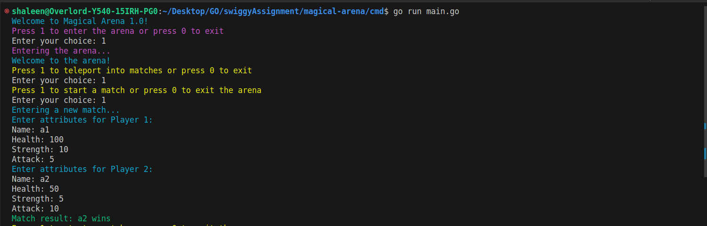
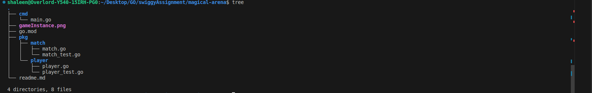

# Magical Arena 1.0

Magical Arena is a multiplayer game application written in Go. It allows two players to compete against each other in multiple matches within an arena.

## Description

Magical Arena is an exciting game that offers a unique gaming experience. Players can engage in thrilling battles within the arena, showcasing their skills and strategies. The game provides a platform for intense competition and endless entertainment.

## Features

- Multiplayer gameplay: Play against another player in real-time.
- Arena matches: Engage in multiple matches within the arena.
- Skill-based gameplay: Showcase your gaming skills and strategies.
- Endless entertainment: Enjoy hours of fun and excitement.

## Installation

1. Install Go by following the official installation guide: [https://golang.org/doc/install](https://golang.org/doc/install)
2. Navigate to the project directory.
3. Run the main file using the command: `go run cmd/main.go`

## Usage

Once the application is running, follow the on-screen instructions to start a match within the arena. Enjoy the thrilling gameplay and compete against your opponent to emerge victorious.

## Testing

to test the player package, open terminal and change directory to `cd pkg/player` and run cmd `go test` on terminal

to test the match package, open terminal and change directory to `cd pkg/match` and run cmd `go test` on terminal

## Usage

Once the application is running, follow the on-screen instructions to start a match within the arena. Enjoy the thrilling gameplay and compete against your opponent to emerge victorious.

## Folder Structure

